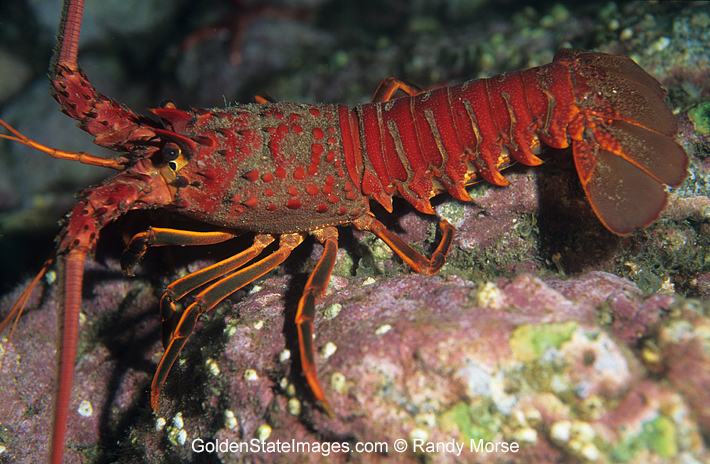
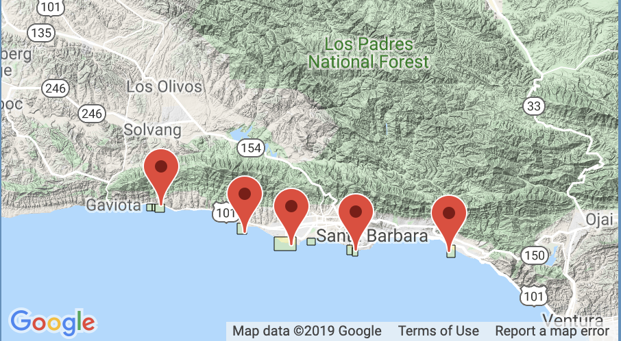

```{r setup, include = FALSE}
knitr::opts_chunk$set(echo = FALSE, warning = FALSE)
```

```{r, include = FALSE}
# Attach library packages

library(tidyverse)
library(purrr)
library(ggplot2)
library(janitor)
library(kableExtra)
library(plotly)
library(effsize)

# Read in data and tidy it using clean_names() and uncount()

lobster_tidy <- readr::read_csv("lobster_abundance_sbc_lter.csv",
na = "-99999") %>% 
  clean_names() %>% 
  tidyr::uncount(count)

```

##### INTRO 
Spiney Lobster (Panulirus interruptus) are a species of special interest in California because they are a key predator in giant kelp forests. Kelp forests provide an abundance of food and coastline protection to shoreline communities. In 2012, 2 Marine protected areas (MPAs) were established in Santa Barbara County at Naples and Isla Vista. The Santa Barbara Coastal Long Term Ecological Research Team began collecting samples at five different kelp forest research sites. Two of these sites are within marine protected areas (Naples and Isla Vista) and three are outside of the marine protected area zones (Arroyo Quemodo, Mohawk, and Carpinteria). In this report, we explore data from the SBC LTR team to analyse lobster population trends, abundance and size in the MPA sites and non-MPA sites in 2012 and 2018.


**Figure 1.** *California spiny lobster (Panulirus interruptus). Credit: [Golden State Images](http://www.goldenstateimages.com/GSI_big.php?img=LOB-005).*



**Figure 2.** *Spacial Coverage of the five data sites. Credit:  [Santa Barbara Coastal LTER, Danial C. Reed](https://portal.edirepository.org/nis/mapbrowse?scope=knb-lter-sbc&identifier=77&revision=newest)*

##### DATA AND METHODS (VANESSA)

The dataset includes abundance (count) and carapace size (mm) data of spiney lobstar in 5 designated sites: 2 MPAs (Naples and Isla Vista) and 3 non-MPAs (Arroyo Quemado, Mohawk and Carpinteria) from 2012 through 2018. The data is collected annually by divers from October to March before the start of the lobster season. During that time, data is collected every 2-4 weeks. Our methods for observing and analyzing the data included visualually exploraing the data and the following statistical tests: two-sided T-tests, mean, SD, sample size, p-value, confidence intervals, QQ plot. Specifically, we used these tests to infer distributions and differences across these key variables: size, count, years and sites. 


###### RESULTS A: Abundance of lobsters per site
```{r, include = FALSE}

# RESULTS A
# Create data frame for results A

lobster_ysite_a <- lobster_tidy %>% 
  count(year, site) %>%
  mutate("site_name" = ifelse(site == "IVEE", "Isla Vista",
                              ifelse(site == "NAPL", "Naples",
                                     ifelse(site == "AQUE", "Arroyo Quemado",
                                            ifelse(site == "CARP", "Carpenteria",
                                            "Mohawk"))))) %>% 
  rename("total_count" = "n")


# Visually explore the data, explore by site

# Jitterplot 
ggplot(lobster_tidy, aes(x = site, y = size_mm)) +
  geom_jitter()

# Violin plot: 
ggplot(lobster_tidy, aes(x = site, y = size_mm)) +
  geom_violin()

# Histogram: 
ggplot(lobster_tidy, aes(x = size_mm)) +
  geom_histogram() +
  facet_wrap(~site)

# QQ plot: 
ggplot(lobster_tidy, aes(sample = size_mm)) +
  geom_qq() +
  facet_wrap(~site)

```

```{r}

# RESULTS A: 
# Create graph for lobster count per site per year

ggplot(data = lobster_ysite_a, aes(x = year,
                                   y = total_count)) +
  geom_line(aes(color = site_name)) +
  labs(x = "Year",
       y = "Lobster Count",
       title = "Lobster Count in Santa Barbara LTER") +
    theme_minimal()+
    scale_x_continuous(expand = c(0,0), 
                     limits = c(2012,2018),
                     breaks = seq(2012, 2018, by = 1)) +
  scale_y_continuous(expand = c(0,0))
  
# scale_color_manual(breaks = c("MPA", "non-MPA"), values = c("blue", "orange")

```

**Figure 3.** *Abundance of spiny lobsters at 5 different SBC LTER sites between the years 2012 and 2018. Growth rates for lobster abundance increased significantly for Isla Vista, while Arroyo Quemado remained stagnat. Data: Reed D. 2019.*
#need to remame site_name 

###### RESULTS B: Lobster size distribution shifts in 2012 & 2018

```{r, include = FALSE}

# RESULTS B
# Q: Is there a significanct difference in lobster size distribution shifts in 2012 and 2018.
# Data sets for lobster size distribution shifts in 2012 and 2018, together and separately

lobster_12_18 <- lobster_tidy %>%
  filter(year %in% c(2012, 2018)) # 2036 observations 

lobster_12 <- lobster_tidy %>% # 231 observations 
  filter(year == "2012")

lobster_18 <- lobster_tidy %>% # 1805 observations 
  filter(year == "2018")

# Based on Central Limit Theorem, the sampling distribution of means in 2018 will be normally distributed because there are 1805 observations. There are 231 observations in the 2012 data, and because of the Central Limit Theorem, we can also assume normally distributed means, regardless of underlying population. Therefore, comparing means using a t-test is OK and we believe the means are a useful metric of comparison. CLT = sampling distribution of the means will be normal.

# Visually explore the data: 

# Histograms: 

ggplot(lobster_12, aes(x = size_mm)) +
  geom_histogram()

ggplot(lobster_18, aes(x = size_mm)) +
  geom_histogram()

# QQ plots:

ggplot(lobster_12, aes(sample = size_mm)) +
  geom_qq()

ggplot(lobster_18, aes(sample = size_mm)) +
  geom_qq()

```

```{r, include = FALSE}

# RESULTS B
# Wrangling data to create a data frame that keeps size measurements from 2012 and 2018, also for MPA vs. non-MPA

lobster_size_b <- read_csv("lobster_abundance_sbc_lter.csv", na = "-99999") %>% 
  clean_names() %>% 
  tidyr::uncount(count) %>% 
  filter(year %in% c(2012, 2018)) %>% 
  group_by(site, year) %>% 
  select(year, size_mm, site) %>% 
  mutate("MPA" = ifelse(site == "IVEE", "MPA",
                        ifelse(site == "NAPL", "MPA",
                               "non-MPA"))) %>%
  mutate("site_name" = ifelse(site == "IVEE", "Isla Vista",
                              ifelse(site == "NAPL", "Naples",
                                     ifelse(site == "AQUE", "Arroyo Quemado",
                                            ifelse(site == "CARP", "Carpenteria",
                                            "Mohawk"))))) %>% 
   mutate(protected = case_when(
    site == "IVEE" ~ "MPA",
    site == "NAPL" ~ "MPA",
    site == "AQUE" ~ "Non-MPA",
    site == "CARP" ~ "Non-MPA",
    site == "MOHK" ~ "Non-MPA"))


```

```{r}

# RESULTS B
# Visually explore lobster size distribution shifts by comparing lobster sizes in 2012 and 2018.

ggplot(data = lobster_size_b, aes(x = site,
                                y = size_mm)) +
          geom_jitter(aes(color = site),
                      alpha = 0.75,
              show.legend = FALSE) +
  labs(x = "Year",
      y = "Carapace Size (mm)",
      title = "Lobster size distribution shifts in Santa Barbara") +
  theme_classic() +
    facet_wrap(~year)

# Data viz exploration
ggplot(data = lobster_size_b, aes(x = site,
                                y = size_mm)) +
          geom_jitter(aes(color = year),
                      alpha = 0.75,
              show.legend = FALSE)


```
**Figure 4.** *Lobster carapace size distribution shifts between 2012 and 2018 increased significantly for both the MPA sites (IVEE and NAPL). There are significantly more sample sizes colelcted for each site in 2018 than in 2012.*
NEEDS DESCRIPTION 


###### RESULTS C: Compare mean lobster sizes at MPA vs. non-MPA sites in 2012 and 2018
```{r, include = FALSE}

# RESULTS C
# Wrangle data for means 
# Create new data set for lobster size means for MPA vs non-MPA 2012 and 2018

lobster_means <- lobster_size_b %>% 
  select(year, size_mm, site, MPA, site_name, protected) %>% 
  group_by(year, protected) %>% 
  summarise(mean_mm = mean(size_mm, na.rm = TRUE),
            sd_size = sd(size_mm, na.rm = TRUE),
            sample_n = n())

# Create two data frames, one for 2012 and one for 2018, Lobster size means to compare size at mpa vs non-MPA sites for stats exploration 

lobster_2012_mean <- lobster_size_b %>% 
  filter(year == 2012) %>% 
  group_by(MPA) %>% 
  summarise(mean_mm = mean(size_mm, na.rm = TRUE),
            sd_size = sd(size_mm, na.rm = TRUE),
            sample_n = n())
  
lobster_2018_mean <- lobster_size_b %>% 
  filter(year == 2018) %>% 
  group_by(MPA) %>% 
  summarise(mean_mm = mean(size_mm, na.rm = TRUE), 
            sd_size = sd(size_mm, na.rm = TRUE),
            sample_n = n())

```

```{r}


```


```{r, include = FALSE}

# RESULTS C 
# Wrangle data to show mean size of lobsters for MPA and non-MPA sites

#lobster_size_b <- lobster_tidy
  #filter(year %in% c(2012, 2018)) %>% 
 # group_by(site, year) %>% 
  #select(year, size_mm, site) %>% 
  #mutate("MPA" = ifelse(site == "IVEE", "MPA",
                        #ifelse(site == "NAPL", "MPA",
                               #"non-MPA"))) %>%
  #mutate("site_name" = ifelse(site == "IVEE", "Isla Vista",
                              #ifelse(site == "NAPL", "Naples",
                                     #ifelse(site == "AQUE", "Arroyo Quemado",
                                            #ifelse(site == "CARP", "Carpenteria",
                                            #"Mohawk"))))) %>% 
  # mutate(protected = case_when(
    #site == "IVEE" ~ "MPA",
   # site == "NAPL" ~ "MPA",
    #site == "AQUE" ~ "Non-MPA",
    #site == "CARP" ~ "Non-MPA",
    #site == "MOHK" ~ "Non-MPA"))

```

```{r}

# RESULTS C
# Graph exploration 
# Create a box plot option 1

ggplot(data = lobster_size_b, aes(x = site, y = size_mm))+
  geom_jitter(aes(color = site),
              show.legend = FALSE) +
  #scale_x_discrete(limits = "AQUE", "CARP","MOHK","IVEE", "NAPL")+
  #scale_fill_discrete(name = "Protected Status")
  geom_boxplot(aes(fill = year), alpha = 0.5, outlier.color = NA, fill = "light blue")+
  labs(x = "Year",
      y = "Size (mm)",
      title = "Lobster size distribution shifts in Santa Barbara LTER")+
  labs(x = "Year", y = "Lobster Size (mm)")+
  scale_color_manual(breaks = c("MPA", "non-MPA"), values = c("orange", "orange", "orange", "light blue", "light blue")) +
  theme_classic()+
    scale_color_manual(breaks = c("MPA", "non-MPA"), values = c("orange", "orange", "orange", "light blue", "light blue"))+
    facet_wrap(~ year)

# need to fix graph so that the colors correspond with MPA and non-MPA. Also need to fix site names to be vertical

# OPTION 2: 
#Create New data frame for MPA only data, and data only from 2012 and 2018

MPA_12_18 <- lobster_tidy %>% 
  filter(year == "2012" | year == "2018") %>% 
  mutate(protected = case_when(
    site == "IVEE" ~ "MPA",
    site == "NAPL" ~ "MPA",
    site == "AQUE" ~ "Non-MPA",
    site == "CARP" ~ "Non-MPA",
    site == "MOHK" ~ "Non-MPA"))

MPA_graph_12_18 <- ggplot(MPA_12_18, aes(x= site, y= size_mm)) +
  geom_boxplot(aes(fill = protected)) +
  facet_wrap(~ year) +
  theme_bw() + #Vanessa, what do you think of this change to the graph? I think it makes it easier to tell the differences in means
  scale_x_discrete(limits = c("AQUE", "CARP", "MOHK", "IVEE", "NAPL")) +
  labs(x = "Site",
       y = "Carapace Length (mm)",
       title = "Size Distribution of Lobsters at Santa Barbara Channel LTER Sites (2012 + 2018") +
  scale_fill_discrete(name = "Protected Status")

MPA_graph_12_18 + theme(panel.spacing = unit(3, "lines")) 

# Need to decide which one we think does a better job at responsibly and clearly describing the data
#Nicole thinks MPA Graph 12_18 is better. We might want to write the entire name out for each site?


```
**Figure 5:** *Size distribution shifts of lobsters at all five sites at years 2012 and 2018 comparing changes in MPA versus non-MPA sites. The average size of lobster carapices increased for both MPA sites (IVEE and NAPL), while the non-MPA sites avaerage carpace sizes remained similar between the years.*

```{r, include = FALSE}

#VANESSA TO FIX FRIDAY...too late to be CODINGGGG
# RESULTS C
# Use a two-sided t-test (because data is unpaired) to look at any differences in mean lobster sizes between MPA and non-MPA, and in 2012 and 2018

MPA_2012 <- lobster_size_b %>% 
  filter(protected == "MPA" | year == "2012")

nonMPA_2012 <- lobster_size_b %>% 
  filter(protected == "Non-MPA" | year == "2012")

t.test(t_test_MPA)

t_test_non_MPA <- lobster_size_b %>% 
  filter(MPA == "non-MPA") %>% 
  pull(size_mm)

t.test(t_test_non_MPA)

## Testing differences in means between carapace length in protected and non-protected sites
 
##H0: There is no difference in carapace lengths between protected and non-protected sites
##HA: There is a difference in carapace lenths between protected and nonprotected sites

##2012

#Nicole changed a few of the names below so it would run. I dont think I changed what you were going for Vanessa, but let me know if you had something different in mind. Sorry if I changed it to soemthing different
mpa12_protected <- MPA_2012 %>%
  filter(protected == "MPA") %>%
  filter(year == "2012")
      
mpa12_unprotected <- MPA_2012 %>%
  filter(protected == "Non-MPA") %>%
  filter(year == "2012")

#mpa12_t <- t.test(mpa12_protected$SIZE, mpa12_unprotected$SIZE, var.equal = TRUE)

#mpa12_t


# **Example statement of test outcome:** # change *p* in comment so it's reproduceable 
# This will be in the Rmd file, NOT in a code chunk, but should still run

#"Mean lead concentration (ppb) measured in immediately collected water samples (`r round(mean_immediate, 2)` $\pm$ `r round(sd_immediate, 2)`, n = `r n_immediate`) differed significantly from lead in water collected after 2 minutes of flushing (`r round(mean_flushed, 2)` $\pm$ `r round(sd_flushed, 2)`, n = `r n_flushed`) by a paired two-sample t-test (t(`r round(my_flint_test$parameter, 2)`) = `r round(my_flint_test$statistic, 2)`, *p* < 0.001)."

# COHEN'S D
# Run Cohen's *d* effect size to report a more meaningful metric of differences between group means
#NEED TO DOUBLE CHECK (from lab 7)

lobster_d <- effsize::cohen.d(lobster_2012_mean$mean_mm, lobster_2018_mean$mean_mm, na.rm = TRUE)


```

```{r}

# RESULTS C
# Create table(s) using kableExtra
# Refer to Lab 7 line 231

#lobster_table <- lobster_means %>%
 #kable(col.names = c("year",
                     #"protected",
                     #"mean_mm")) %>%
 #kable_styling(bootstrap_options = c("striped", "condensed"),
               #full_width = F,
               #position = "left") %>%
 #add_header_above(c("Lobster Mean Size at MPA and Non-MPA sites (2012 + 2018)" = 8))

lobster_table <- lobster_means %>% 
  kable() %>% 
  kable_styling(bootstrap_options = c("striped", "condensed"),
               full_width = F,
               position = "left")

```


##### SUMMARY 
- mpa versus non-MPA
- different sample sizes (n) making a difference in analysis?
-

NEED TO WRITE


##### REFERENCES

Reed D. 2019. *SBC LTER: Reef: Abundance, size and fishing effort for California Spiny Lobster (Panulirus interruptus), ongoing since 2012.* Environmental Data Initiative. https://doi.org/10.6073/pasta/a593a675d644fdefb736750b291579a0. Dataset accessed 10/30/2019.

